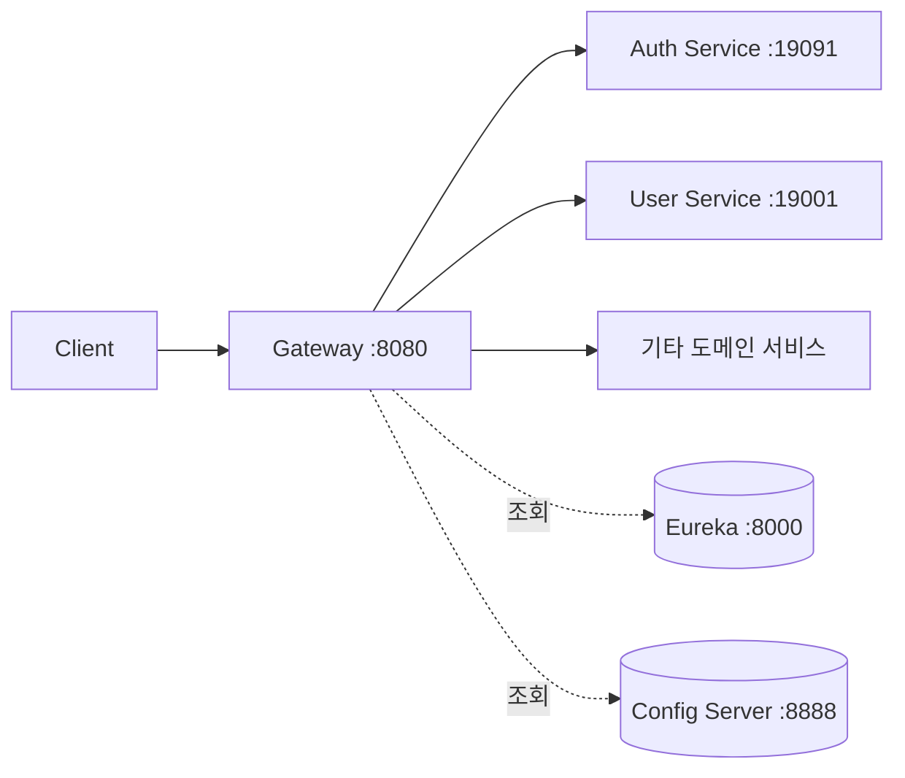
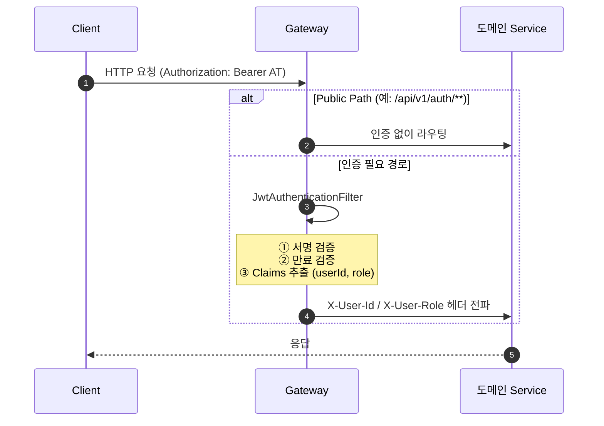

# Pagely — Gateway

Pagely MSA 의 API Gateway 클라이언트의 모든 요청 진입점을 담당합니다.

## 책임

- 서비스별 라우팅 (Spring Cloud Gateway 의 WebFlux 기반)
- JWT 검증 (`JwtAuthenticationFilter`)
- Public Path 관리 (인증 불필요 경로)
- `/internal/**` 외부 차단 (내부 서비스 간 호출 전용 endpoint 보호)
- Eureka 기반 서비스 디스커버리

## 기술 스택

- Java 21, Spring Boot 3.5.13
- Spring Cloud Gateway (WebFlux)
- Spring Cloud Netflix Eureka Client
- jjwt (HS256)

## 아키텍처에서의 위치



## 요청 처리 흐름



## Public Path

인증 없이 접근 가능한 경로. `application.yml` 의 `jwt.public-paths` 에서 관리.

- `/api/v1/auth/**` — 로그인 / 갱신 / 로그아웃
- `/actuator/**` — 헬스 체크 / 메트릭
- `/api/v1/payment/webhook` — 외부 결제 webhook
- 회원가입 등 비로그인 사용자가 접근하는 endpoint

## /internal/** 외부 차단

`/internal/**` 으로 시작하는 endpoint 는 내부 서비스 간 호출 전용. Gateway 의 라우팅에 등록되지 않으므로 외부 요청은 자동으로 404.

화이트리스트 패턴 (`/api/v1/**` 만 명시적 라우팅) 으로 적용. 별도 차단 룰 불필요.

## 라우팅 정책

| 경로 | 라우팅 대상 |
| --- | --- |
| `/api/v1/users/**`, `/api/v1/auth/**` | User Service / Auth Service |
| `/api/v1/sale-posts/**`, `/api/v1/orders/**` | Market Service |
| `/api/v1/payments/**`, `/api/v1/payment/webhook` | Payment Service |
| `/api/v1/books/**` | Book Service |
| `/api/v1/reports/**` | Report Service |
| `/api/v1/meetings/**` | Meeting Service |
| `/api/v1/map/**` | Map Service |
| `/api/v1/chat/**` | Chat Service |
| `/api/v1/ai/**` | AI Service |

## JwtAuthenticationFilter

`GlobalFilter` 로 등록. 모든 요청에서 다음을 수행.

1. Public Path 검사 — 일치 시 다음 필터로 패스
2. `Authorization: Bearer {AT}` 헤더 추출
3. 서명 / 만료 검증 (HS256, jjwt)
4. Claims 추출 (`sub` = userId, `role`)
5. 다운스트림 서비스에 `X-User-Id` / `X-User-Role` 헤더 전파

검증 실패 시 401 응답.

## 실행

### 사전 조건

- Java 21
- Eureka (localhost:8000)
- Config Server (localhost:8888)
- 환경 변수: `JWT_SECRET` (HS256 의 256bit, base64)

### 기동

```bash
./gradlew bootRun
```

### 빌드 (Docker)

```bash
./gradlew bootBuildImage
docker run -p 8080:8080 \
  -e JWT_SECRET=... \
  -e EUREKA_SERVER_URL=http://localhost:8000/eureka/ \
  pagely-gateway:latest
```

## 환경 변수

| 키 | 설명 | 기본값 |
| --- | --- | --- |
| `JWT_SECRET` | JWT 서명 키 (HS256, base64) | 필수 |
| `EUREKA_SERVER_URL` | Eureka 주소 | `http://localhost:8000/eureka/` |
| `HOSTNAME` | Eureka 등록 호스트명 | `localhost` |
